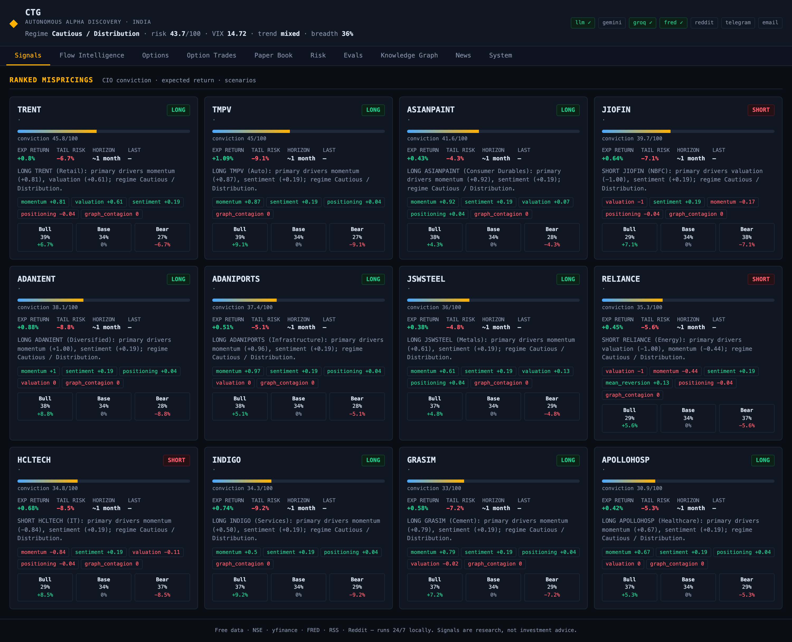
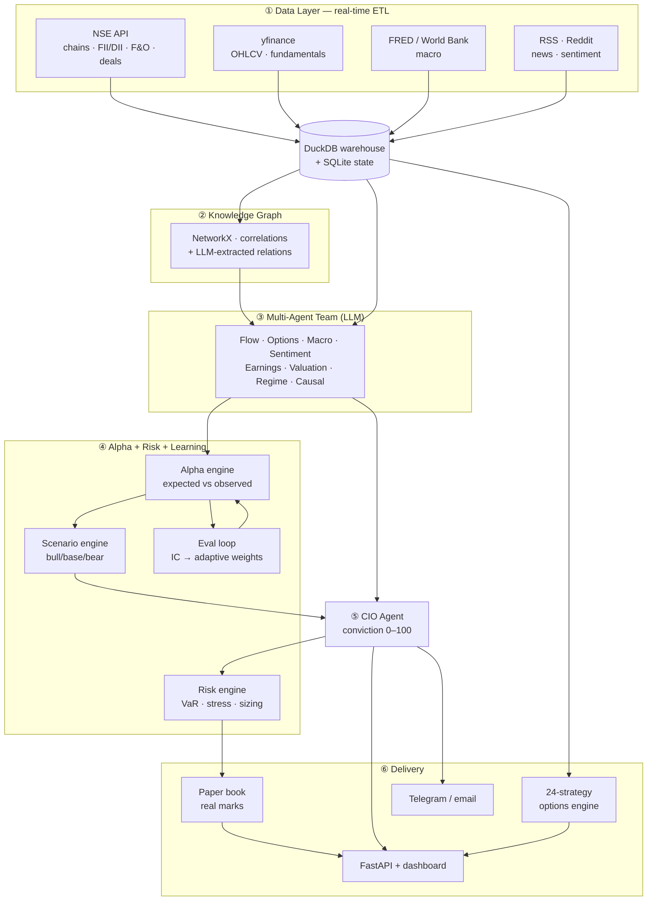
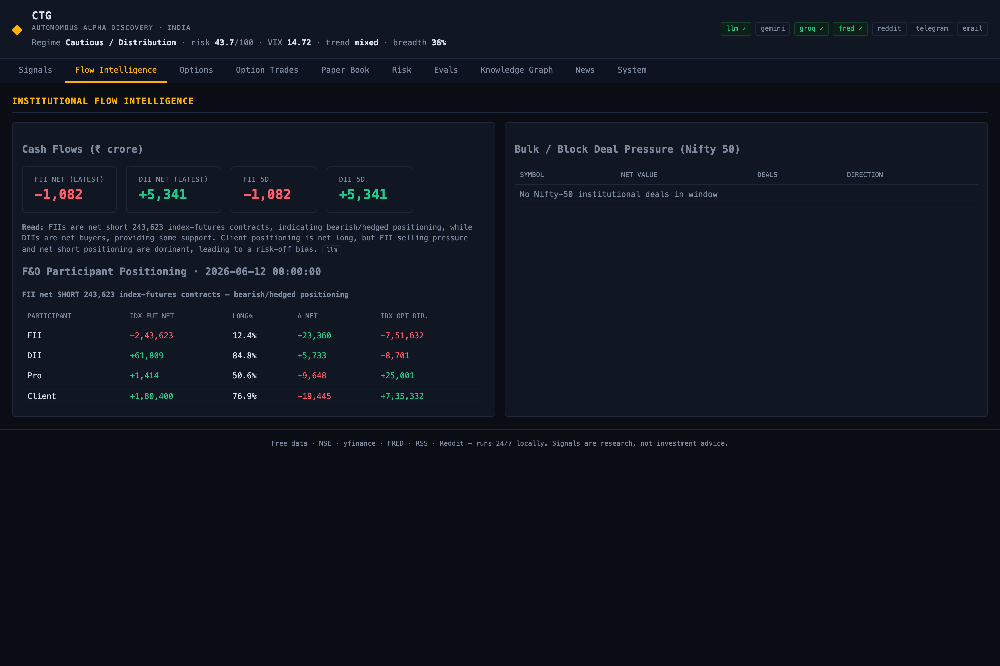
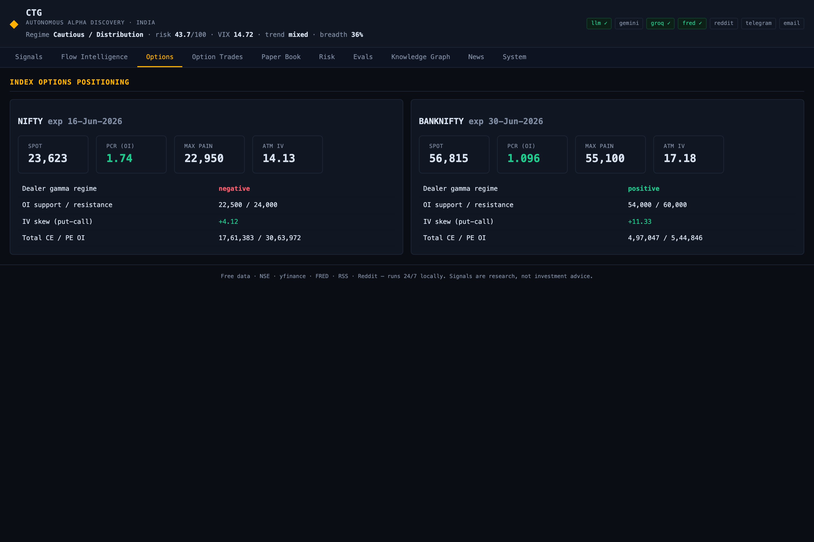
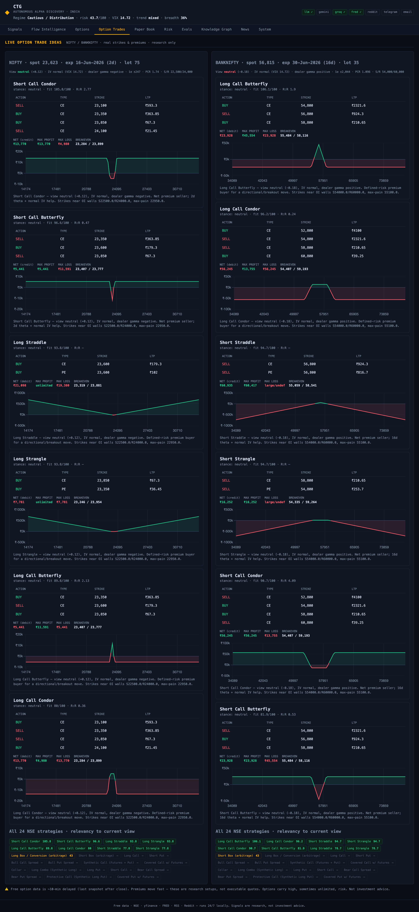
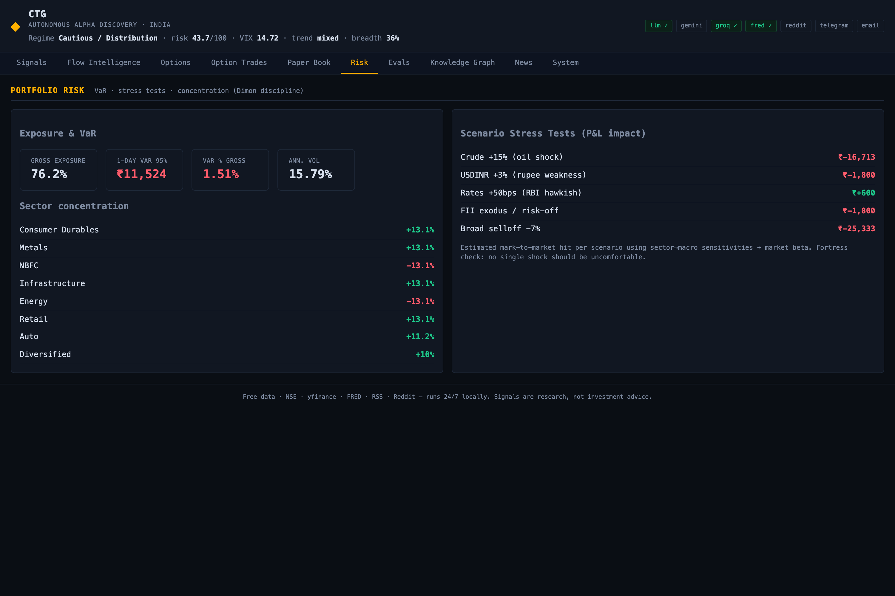
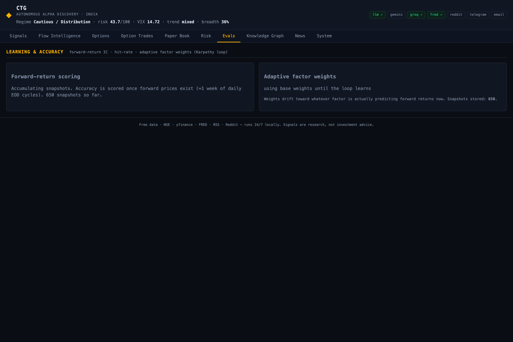
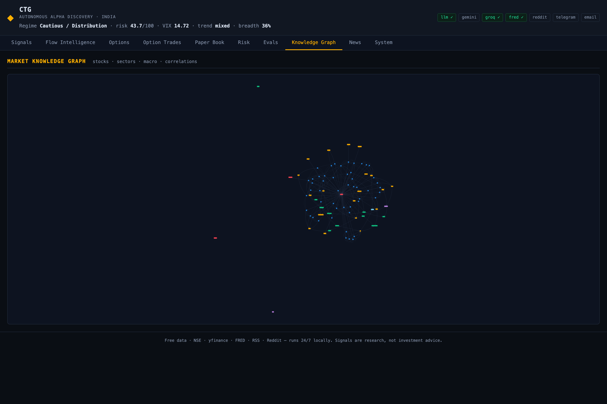

<div align="center">



<br/>

<a href="https://github.com/ChethanKMurthy/CTGTerminal">

</a>

<br/><br/>

[](https://github.com/ChethanKMurthy/CTGTerminal/actions/workflows/ci.yml)


**Multi-agent quantitative research platform** that ingests live market data, reasons over it with a team of LLM agents, ranks mispricings with explainable conviction, sizes a risk-disciplined paper book, suggests live options strategies, and **measures its own predictive accuracy to improve over time** — built end-to-end with only free, real-world data sources.

</div>

---

## ✨ TL;DR

> A from-scratch **AI hedge-fund research engine** for the Indian market. It fuses **real-time data engineering**, **multi-agent LLM orchestration**, **quantitative finance** (options Greeks, dealer gamma, regime detection), **portfolio risk management** (VaR, stress tests), and an **MLOps-style learning loop** (information-coefficient–driven adaptive weights) behind an async **FastAPI** service and a live terminal dashboard — all running 24/7 on a single machine with zero paid APIs.

<div align="center">

<em>Live dashboard — ranked mispricings with conviction, expected return, tail risk, factor attribution and probabilistic scenarios.</em>
</div>

---

## 🧠 Why this is interesting (engineering highlights)

| Domain | What I built |
|---|---|
| **Data Engineering** | Fault-tolerant **real-time ETL** from 8+ free sources (NSE option chains, FII/DII & F&O participant flows, bulk/block deals, OHLCV, FRED macro, RSS, Reddit). Browser-session emulation + cookie handshake to defeat NSE bot-blocking, exponential backoff, idempotent upserts, freshness heartbeats. |
| **Storage** | Hybrid **OLAP + OLTP**: DuckDB columnar warehouse for time-series analytics, SQLite (WAL) for transactional app state, NetworkX for the graph — embedded, zero-ops. |
| **LLM / GenAI** | **Multi-agent orchestration** (9 specialist agents) over a provider-agnostic LLM gateway with **failover (Gemini ⇄ Groq)**, token-bucket **rate limiting**, disk **response caching**, JSON-mode structured output, and **graceful degradation** to deterministic rules when quota is exhausted. |
| **Knowledge Graph** | A live **market graph** (stocks ↔ sectors ↔ indices ↔ macro) built from curated maps, realised-return correlations, and **LLM-extracted relations** from news headlines; traversed for second-order contagion signals. |
| **Quant Finance** | Black–Scholes **Greeks**, **dealer gamma exposure (GEX)**, PCR, max-pain, IV skew, regime classification, and a **24-strategy options engine** (spreads, condors, butterflies, straddles, ratio/synthetic/box) ranked by a *direction × IV × gamma* decision matrix. |
| **Risk Management** | **Vol-targeted** position sizing, per-name & **sector concentration caps**, **drawdown de-grossing**, historical **VaR / Expected Shortfall**, and scenario **stress tests** (crude, USD/INR, rates, FII-exodus, broad sell-off). |
| **ML / MLOps** | A **self-evaluating learning loop**: every signal's factor vector is snapshotted, scored on **forward returns**, and converted to per-factor **Information Coefficient (IC)** + hit-rate that **adaptively reweights** the alpha model — no look-ahead, fully reproducible. |
| **Backend / Full-Stack** | Async **FastAPI** REST API, **APScheduler** market-hours-aware job orchestration, a dependency-free real-time dashboard (vanilla JS + Chart.js), Telegram/email alerting, and one-command **24/7 deployment** via a macOS LaunchAgent. |

---

## 🏗️ Architecture



---

## 📸 Demo

<table>
<tr>
<td width="50%"><p align="center"><em>Institutional Flow Intelligence — FII/DII cash + F&O participant positioning + bulk/block deals</em></p></td>
<td width="50%"><p align="center"><em>Index Options — PCR, max-pain, dealer-gamma regime, IV skew, OI walls</em></p></td>
</tr>
<tr>
<td width="50%"><p align="center"><em>Live Option Trade Ideas — 24 strategies ranked by relevancy, with real strikes, premiums & payoff diagrams</em></p></td>
<td width="50%"><p align="center"><em>Portfolio Risk — VaR / Expected Shortfall, sector concentration & scenario stress tests</em></p></td>
</tr>
<tr>
<td width="50%"><p align="center"><em>Learning &amp; Accuracy — forward-return Information Coefficient, hit-rate, adaptive factor weights</em></p></td>
<td width="50%"><p align="center"><em>Market Knowledge Graph — entities &amp; relationships, interactively explorable</em></p></td>
</tr>
</table>

---

## 🛠️ Tech Stack

**Language** · Python 3.12 (type-hinted, dataclasses)
**Backend** · FastAPI · Uvicorn (ASGI) · APScheduler
**Data** · DuckDB · SQLite (WAL) · NetworkX · pandas · NumPy · SciPy
**GenAI** · Google Gemini · Groq (Llama-3.3-70B) · provider-agnostic gateway with failover, rate-limiting, caching
**Ingestion** · requests (session/cookie emulation) · yfinance · feedparser · PRAW · FRED / World Bank APIs
**Frontend** · Vanilla JS · Chart.js · vis-network (zero build step)
**Ops** · launchd 24/7 service · rotating logs · Telegram / SMTP alerting · `.env` secret management

#### Concepts demonstrated
`distributed data pipelines` · `real-time streaming ETL` · `multi-agent systems` · `LLM orchestration` · `RAG-style retrieval` · `knowledge graphs` · `quantitative finance` · `options pricing & Greeks` · `time-series analysis` · `feature engineering` · `regime detection` · `Monte-Carlo-free probabilistic scenarios` · `portfolio optimization` · `Value-at-Risk` · `stress testing` · `backtesting` · `information coefficient` · `online learning / adaptive weighting` · `fault tolerance` · `rate limiting` · `caching` · `graceful degradation` · `idempotency` · `observability` · `REST API design` · `async I/O`

---

## 🚀 Quickstart

```bash
git clone https://github.com/ChethanKMurthy/CTGTerminal.git
cd CTGTerminal

python3.12 -m venv .venv && source .venv/bin/activate
pip install -r requirements.txt

cp .env.example .env        # add free API keys (all optional — see below)
python run.py               # boot warm-up + 24/7 scheduler + dashboard
```

Open **http://localhost:8799** 🎉

> Every API key is **optional** — the system degrades gracefully and still runs on pure deterministic logic. Add a free [Gemini](https://aistudio.google.com/apikey) or [Groq](https://console.groq.com/keys) key for LLM reasoning, [FRED](https://fredaccount.stlouisfed.org/apikeys) for macro, and a Telegram bot token for phone alerts.

#### Run modes
```bash
python run.py --once       # run one full end-to-end cycle and exit (cron-friendly)
python run.py --web-only   # dashboard only, over existing data
```

#### 24/7 auto-start (macOS)
```bash
cp deploy/com.ctg.alpha.plist ~/Library/LaunchAgents/
launchctl load ~/Library/LaunchAgents/com.ctg.alpha.plist
```

---

## 📂 Project structure

```
ctg/
├── data/         # real-time collectors: NSE, prices, macro, news, social, universe
├── storage/      # DuckDB warehouse, SQLite state, NetworkX graph persistence
├── llm/          # provider-agnostic LLM gateway (failover, rate-limit, cache)
├── agents/       # 9 specialist agents (flow, options, macro, sentiment, ...)
├── engine/       # knowledge graph, alpha, scenarios, regime, risk, evals,
│                 #   quant analytics, 24-strategy options engine
├── portfolio/    # risk-sized paper-trading book with real marks
├── alerts/       # Telegram + email dispatch with dedup
├── scheduler/    # market-hours-aware job orchestration + pipelines
└── web/          # FastAPI app + real-time dashboard
```

---

## 🔬 Engineering deep-dives

<details>
<summary><b>Defeating NSE bot-blocking & building a resilient ingestion layer</b></summary>

NSE's public JSON endpoints return `403`/`401` to naked requests and block datacenter IPs. The client emulates a browser: warms cookies via the homepage + option-chain page, sends a full header set (and deliberately *omits* brotli, which silently corrupts JSON), throttles requests, rotates the session on auth failure, and retries with backoff. Endpoints also change shape over time (the option chain moved from `/option-chain-indices` to a `contract-info → option-chain-v3` two-step) — the client adapts. Every collector is **idempotent** (`INSERT OR REPLACE` on natural keys) and writes a **freshness heartbeat** surfaced on the dashboard's System tab.
</details>

<details>
<summary><b>The self-learning eval loop (the MLOps bit)</b></summary>

Static factor weights overfit and decay. Instead, every cycle snapshots each candidate's full **factor vector + entry price**. Once genuine **forward prices** exist (no look-ahead), the loop computes per-factor **Information Coefficient** (correlation of factor value with forward return) and the composite **hit-rate**, then blends those into **adaptive weights** the alpha engine consumes next cycle. The model literally tilts toward whatever is predictive *right now* and is fully reproducible from the warehouse.
</details>

<details>
<summary><b>Free-tier-proof LLM gateway</b></summary>

A single gateway abstracts Gemini and Groq behind one interface with **provider failover**, a sliding-window **token-bucket rate limiter**, a TTL **disk cache** keyed on (model, prompt), JSON-mode parsing with repair, and **cooldown-based circuit breaking**: when a provider hits its daily token cap it's benched for 30 min and the whole system falls back to deterministic rules — no crashes, no 20-second retry storms, no dropped cycles.
</details>

<details>
<summary><b>Risk-first capital allocation</b></summary>

Signals don't become positions blindly. The risk engine vol-targets each name (size ∝ conviction ÷ realised vol), enforces per-name and per-sector caps, **de-grosses on drawdown**, scales gross by regime, then reports 1-day historical **VaR/ES** and marks the book against five macro **stress scenarios** so no single shock is uncomfortable.
</details>

---

## ⚠️ Disclaimer
Research & educational project. **Not investment advice.** All trading is simulated (paper). Free market data is delayed; option premiums are indicative, not executable quotes. Options and futures carry high, sometimes unlimited, risk.

## 📚 Docs
[Architecture](docs/ARCHITECTURE.md) · [Data Sources](docs/DATA_SOURCES.md) · [Roadmap](ROADMAP.md) · [Changelog](docs/CHANGELOG.md) · [Contributing](CONTRIBUTING.md) · [Security](SECURITY.md)

## 📄 License
MIT — see [LICENSE](LICENSE).

<div align="center"><br/><sub>Built with a focus on real data, sound quant, and production-grade engineering.</sub></div>
